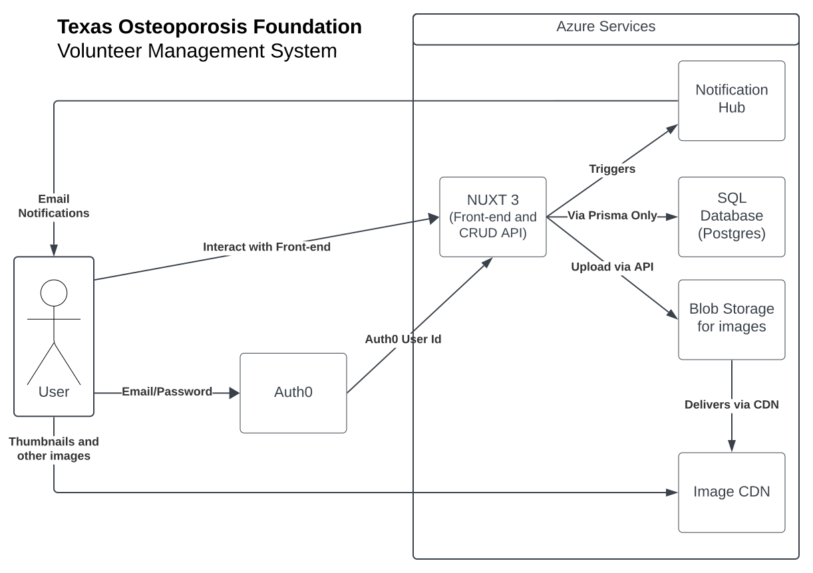

# Tech Stack

### Vue 3

Vue is a declarative, component-based UI language similar to React and Svelte. Vue provides custom attributes such as `v-if` and `v-for` that allow elements to update based on reactive data.

See more about how to use Vue 3 [here](https://vuejs.org/guide/introduction.html)

We are not using Vue alone. We are using the [Nuxt](#nuxt-3) framework which uses Vue in a server-rending context. This means you can ignore the documentation about how to setup a Vue application and focus more on how to create components.

Every page in our project is a component, and each page is made up of more components. Page components are located in the `/page` directory, and stand-alone components are located in the `/components` directory. Each component follows the same format:

- A `<script setup lang="ts">` tag that holds [TypeScript](#typescript) code that provides functionality to the component.
- A `<template>` tag that holds HTML tags and other components

Vue supports custom styling via a `<style>` tag, but we use [Tailwind](#tailwind) instead. Therefore, do not use a `<style>` tag unless absolutely necessary.

**Please read about how to format Vue components [here](./formatting.md).**

### Nuxt 3

Nuxt 3 is a server-side rendering framework based on [Vue](#vue-3). It provides features for routing, backend APIs, state management (stores), and more.

For this project, we specifically use three key features:

- We use routing via the `/page` directory to dynamically generate URL routes for our different pages. See how this works [here](https://nuxt.com/docs/getting-started/routing).

- We use stores (located in `/stores`) to share values between every page. We mostly use this to cache information about the user instead of requesting it repeatedly whenever it is needed.

  - Internally, Nuxt uses [Pinia](https://pinia.vuejs.org/) to handle stores. Use their documentation for information how to handle stores.

- We use Nuxt API endpoints (located in `/server/api`) to provide data and functionality to our frontend via [RESTful](https://en.wikipedia.org/wiki/REST) queries.
  - We use a [CRUD](https://en.wikipedia.org/wiki/Create,_read,_update_and_delete) model for each endpoint which is why there are multiple files named `[id].get.ts`, `[id].delete.ts`, etc.
  - Almost every endpoint interfaces with the database using [Prisma](#prisma). This is because we do not want users directly interfacing with Prisma or the database.
  - We use a middleware to authenticate all calls to our API before actions are performed. See more about authentication [here](./authentication.md).
  - See more about how Nuxt server APIs work [here](https://nuxt.com/docs/guide/directory-structure/server).

By default, Nuxt uses automatic imports so no `import` statements are needed to use code you wrote in other files. However, this can be buggy, so look [here](https://nuxt.com/docs/guide/concepts/auto-imports) if you are having trouble with components not showing up or other issues. Any components or functions from libraries installed via NPM will need to be imported explicitly.

### Prisma

Prisma is a TypeScript-based Object Relational Mapper (ORM). Basically, this means it translates schemas defined in `/prisma/schema.prisma` into both a SQL database schema and TypeScript functions. This means you will never need to write any SQL for this project since Prisma handles all SQL calls. This makes working with the database is much easier and safer.

The database structure can be modified by simply changing `schema.prisma`. However, you must always call `npx prisma generate` whenever this file changes. This also includes whenever you pull from the repository.

The command `npx prisma migrate dev` will update the [Postgres](#postgres) database to whatever is defined in `prisma.schema`. Prisma will attempt to do so automatically, but sometimes it cannot if it will overwrite existing data. Learn how to migrate the database manually [here](https://www.prisma.io/docs/guides/migrate/developing-with-prisma-migrate/customizing-migrations).

If you have any errors with Prisma, 99% of the time it is because of one of these three things:

- You forgot to run `npx prisma migrate dev`
- You forgot to run `npx prisma generate`
- Your `DATABASE_URL` environment variable is invalid

Make sure you look at these things before you ask someone else for help.

**See how to get/update data using Prisma [here](https://www.prisma.io/docs/concepts/components/prisma-client/crud)**

### Postgres

Postgres the SQL database that we use to host our data. Because we never interact directly with it (thanks to [Prisma](#prisma)), you don't have to worry too much about it.

Just make sure you read the [setup information](./setup.md) on how to setup the database.

### Typescript

TypeScript is a superset of JavaScript that includes types. This means that writing TypeScript is just like writing JavaScript, but types need to be included with variables and functions.

See how to use TypeScript [here](https://www.typescriptlang.org/docs/handbook/2/basic-types.html).

We chose to use TypeScript because type safety eliminates many bugs at compile-time.

### Tailwind

Tailwind is an alternative to writing CSS from scratch. It provides thousands of custom HTML classes that allow you to apply CSS on an element by element basis.

See how to use it [here](https://tailwindcss.com/docs/utility-first).

We chose to use Tailwind because it can often be faster than writing CSS by hand. It also provides visual consistency across all elements sharing the same classes.

### FormKit

Instead of using vanilla HTML forms, we use custom FormKit components to create forms. They work just like regular HTML components like `<input>` and `<form>`, but they provide more features such as automatic validation, `v-model` support, and submit handling.

See how to use it [here](https://formkit.com/getting-started/your-first-form). Note that we are using the free version, so we do not have access to pro components.

All of the styling for FormKit is in `/assets/formkit-tailwind-theme.ts`.

### Yup

Yup is a object validation library that makes sure data sent to the server via endpoints are in the correct format with valid data. Yup should be used whenever a user sends data via a POST request to maintain type safety. There is a util function called `validateBody` that does this automatically.

See how to use Yup [here](https://github.com/jquense/yup#getting-started).

### Azure

We use Microsoft Azure for our deployment, image CDN, and email notifications.

The image CDN is done using a Blob Storage instance to store the files and a CDN Front Door instance for accessing the images anonymously. Files can be uploaded or deleted via the `/api/images` endpoint. Internally, the endpoints use the official [Azure JavaScript SDK](https://learn.microsoft.com/en-us/azure/developer/javascript/).

As of December 2023, the project is not actively deployed on Azure. However, it is planned to be deployed using [Azure Static Web Apps](https://learn.microsoft.com/en-us/azure/static-web-apps/deploy-nuxtjs) and [Azure SQL](https://azure.microsoft.com/en-us/products/azure-sql/database).

In order to use Azure, the environment variables must be [setup](./setup.md) correctly.

### Auth0

Authentication is done using [Auth0](https://auth0.com/). It handles passwords, emails, and third-party sign ons (i.e. Sign in with Google). Whenever a user wants to login, they get redirected to Auth0 where they fill in their information. Once they fill it in, they get redirected back to our website.

Auth0 does not handle usernames or other user data. See how authentication and user data storage is done [here](./authentication.md).

Fun fact, Auth0 is how ACM handles its logins.

### GitHub

If you are reading this, you should know what GitHub is. If you don't, GitHub is how we host and combine our code.

Important takeaways:

- You cannot push directly to main. Instead, make a separate branch with your changes and make a Pull Request.
- Pull Requests must be approved by someone else, so make sure you have someone else look at your code.
- Don't commit environment variables or other secrets to GitHub. If you add a new file with private data, add it to `.gitignore`.

We recommend using VS Code's [built-in Git integration](https://code.visualstudio.com/docs/sourcecontrol/overview).
